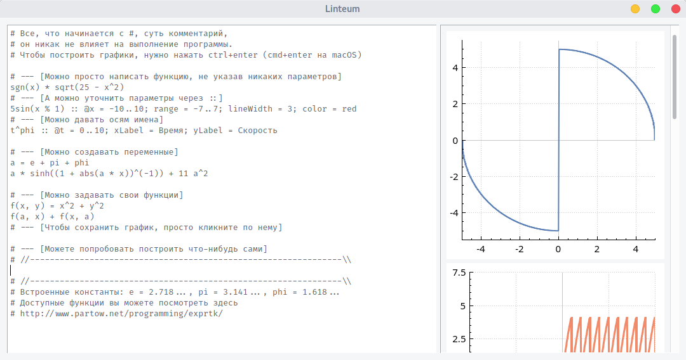
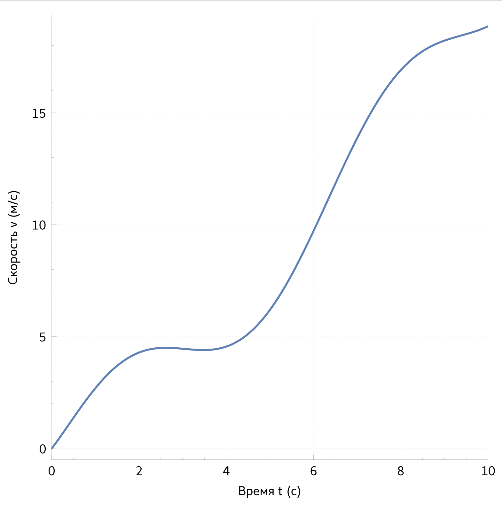

## Моя курсовая работа на 2-ом году обучения в бакалавриате Политеха

Linteum — приложение для построение графиков, написано в среде разработки Qt Creator с ипользованием фреймворка Qt.

Скриншот из приложения:

Пример построенного графика:

